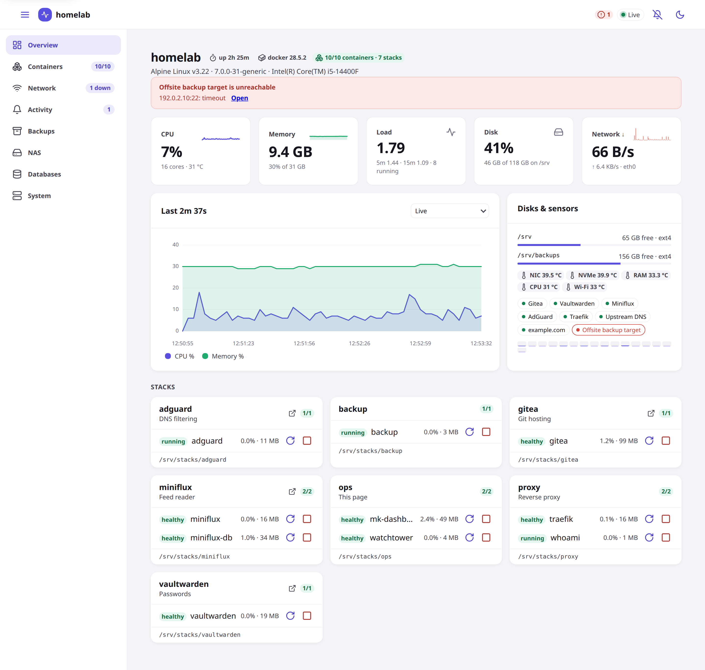
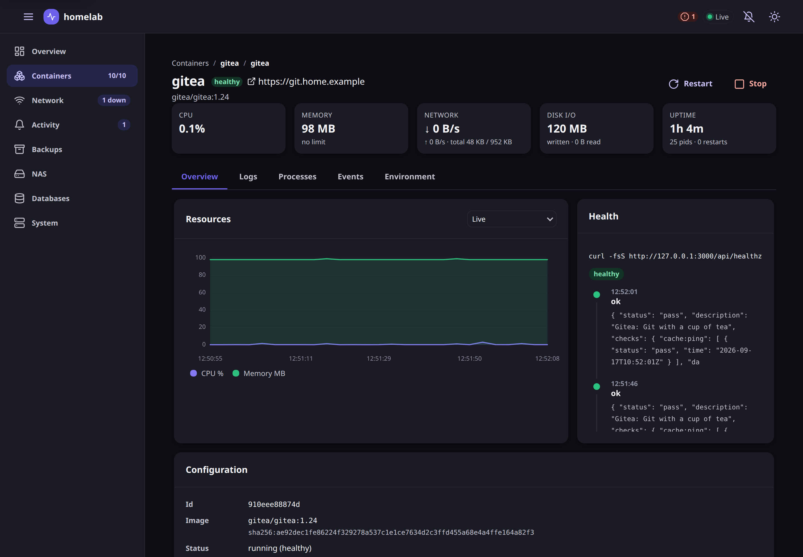
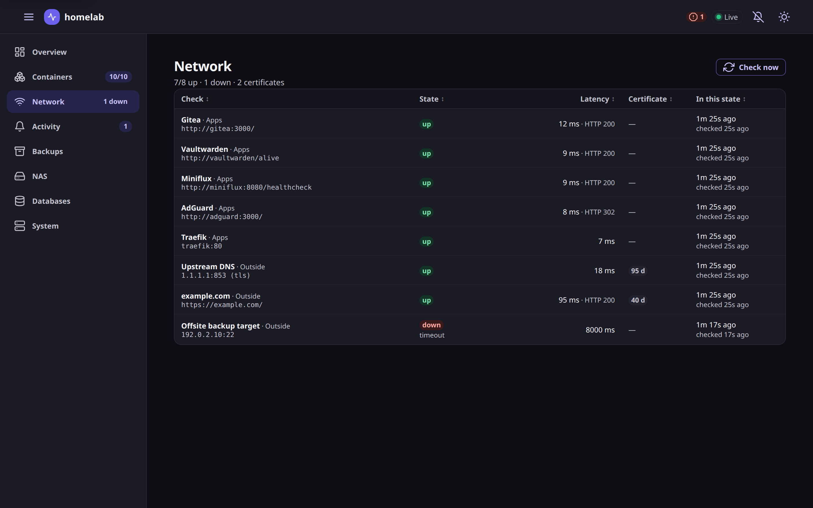
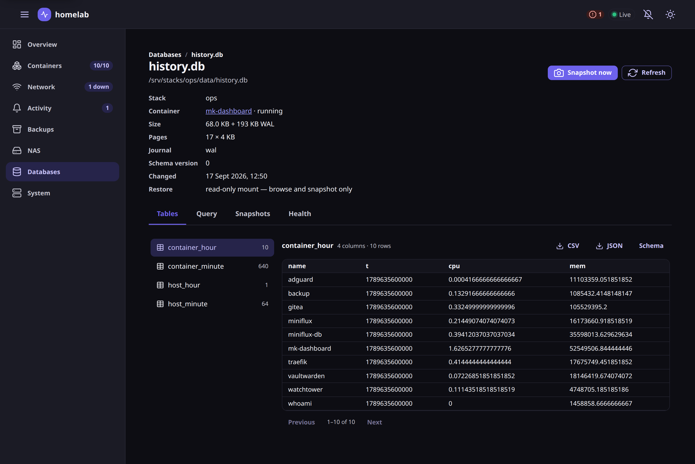
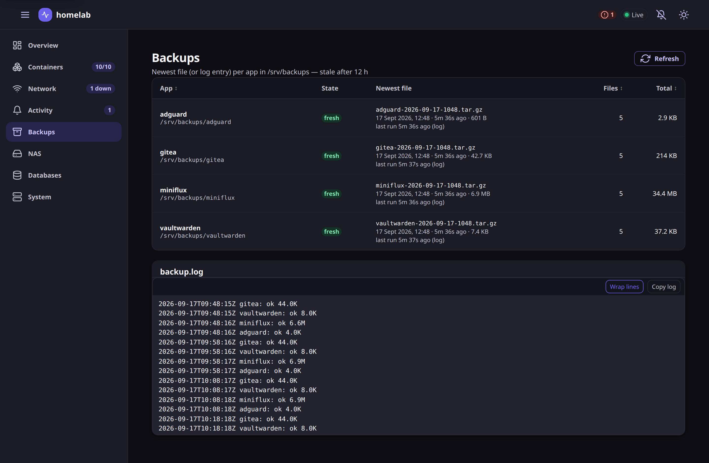

# mk-dashboard

A small, self-hosted dashboard for a single Docker host — the kind of box
that runs a handful of `docker compose` stacks. One container, no database,
nothing to configure beyond a few mounts.

<picture>
  <source media="(prefers-color-scheme: dark)" srcset="docs/screenshots/overview-dark.png">
  
</picture>

| | |
| --- | --- |
|  |  |
|  |  |

The screenshots are of a pretend homelab, not a real one: [`tools/demo/up.sh`](tools/demo/up.sh)
starts it (docker-in-docker, a few small apps as compose stacks, the dashboard built from
the checkout) — also the quickest way to try the dashboard without pointing it at anything of yours.

- **Host vitals** — CPU (per core), memory, swap, load, uptime, disks, network
  rates, temperatures (hwmon), pending reboot. Live, over server-sent events,
  and a stored history behind the charts' range picker: per minute for a day,
  per hour for a month, host and per container.
- **Stacks & containers** — grouped by compose project, health, CPU/memory,
  ports, links to the app (from labels). A sortable, searchable table too.
- **Container detail** — live charts, config (ports, mounts, networks, command,
  environment with secrets masked), health-check history, processes, and
  **logs streamed live** with search.
- **Actions** — start / stop / restart, "update now" through
  [watchtower](https://containrrr.dev/watchtower/)'s HTTP API, prune images.
  Every disruptive action confirms first; `DASH_READONLY=true` hides them all.
- **Backups** — freshness of the newest file per app in a backups directory,
  stale after N hours, plus the log tail.
- **Databases** — every SQLite file the stacks keep: size, WAL, which
  container owns it; tables, schema and rows; one read-only query with CSV/JSON
  export; integrity check; snapshots through SQLite's online backup and a
  restore that stops the owning container, swaps the file and starts it again.
- **System** — engine info, docker disk usage, images, volumes, networks.
- **Network** — reachability checks (HTTP or TCP, optionally TLS) for your
  apps, other machines and public sites, with certificate expiry. Checks come
  from `mk-dashboard.url` labels automatically, plus a JSON list of your own.
- **Alerts & notifications** — unhealthy or restarting containers, OOM kills,
  full disks, memory pressure, hot sensors, stale backups, unreachable hosts,
  expiring certificates, SQLite files that fail their nightly integrity check,
  stop checkpointing or go too long without a snapshot. An alert that persists longer than a delay is pushed
  to your devices (web push, no third-party service), and again when it
  resolves. Telegram and a generic webhook are optional extras. History is kept.
- **Installable** — a PWA: add it to the phone home screen, tap the bell to
  get alerts on that device.
- **Activity** — a timeline of docker events (start, stop, exit codes, OOM,
  health changes), host-wide and per container.

Built with Angular 22 and [@mk-kit/ui](https://mk-kit.dev) (light & dark,
keyboard-friendly), served by a Fastify API on Node 24. No native modules.

## Run it

```yaml
services:
  mk-dashboard:
    image: ghcr.io/mkornas/mk-dashboard:latest
    container_name: mk-dashboard
    restart: unless-stopped
    ports: ["8800:8800"]
    volumes:
      - /var/run/docker.sock:/var/run/docker.sock
      - /proc:/host/proc:ro
      - /sys:/host/sys:ro
      - /:/host/root:ro
```

Open `http://<host>:8800`. See [`docker-compose.yml`](docker-compose.yml) for
the full example with every variable.

### Exposing it: authentication

The docker socket makes the dashboard root-equivalent, so never put it on the
internet bare. Supported setups, combinable:

- **LAN only** — the default. Requests from `DASH_TRUSTED_CIDRS` (private
  ranges) need nothing; with no other door configured, everyone else is
  refused. A browser on the docker host itself usually arrives from the
  bridge gateway (`172.17.0.1`), so add `172.16.0.0/12` if you open it there.
  A reverse proxy on a trusted network is believed about the client address
  (`X-Forwarded-For`, read from the right) — only put one there that sets it.
- **Cloudflare Access** — put the dashboard behind a Cloudflare Tunnel with an
  Access application (email one-time PIN, Google, …) and set
  `DASH_ACCESS_TEAM` and `DASH_ACCESS_AUD`. The server then verifies the
  signed `Cf-Access-Jwt-Assertion` on every request that came through
  Cloudflare, so nothing gets through without a login even if the origin is
  reached some other way. `DASH_ADMIN_EMAILS` limits who may run actions;
  everyone else signed in gets a read-only view. LAN requests keep working
  without a token.
- **Single sign-on** — point the dashboard at an OpenID Connect provider
  (Pocket ID, Authelia, Keycloak, …) with `DASH_OIDC_ISSUER`,
  `DASH_OIDC_CLIENT_ID` and `DASH_OIDC_CLIENT_SECRET`; register
  `https://<dashboard>/auth/callback` at the provider. A browser that is not
  identified any other way is sent to the provider and comes back with a
  signed 30-day cookie; only `DASH_OIDC_EMAILS` (or `DASH_ADMIN_EMAILS`), as
  emails the provider has verified, get in — anyone else lands back on the dashboard with the reason and a button
  to try another account. Works with or without Access, and LAN requests keep
  working without a login. A provider that is not up yet when the dashboard
  starts is retried on the first login. "Sign out" drops the cookie and, when
  the provider supports RP-initiated logout, ends its session too — register
  `https://<dashboard>/` as the logout redirect there. Built on
  [`@mk-kit/auth`](https://github.com/mk-kit/mk-kit/tree/main/projects/auth).
- **Basic auth** — `DASH_USER` / `DASH_PASSWORD` gate everything, on top of
  the above if both are set. After a wrong password the address waits, one
  second doubling up to thirty.
- `DASH_READONLY=true` removes every action regardless of who is asking.

Whatever the door, mutating API calls that do not come from the dashboard's own
pages (`Sec-Fetch-Site`, or the `Origin` on plain http), or that are not JSON,
are refused (a page on another site, a sibling subdomain or another port on the
same host cannot make your browser stop a container), and every response carries the usual hardening headers plus a
same-origin Content-Security-Policy on the app itself.

### Configuration

| Variable | Default | What |
| --- | --- | --- |
| `PORT` | `8800` | Listen port |
| `DASH_HOSTNAME` | host's `/proc/sys/kernel/hostname` | Name shown in the header |
| `DASH_READONLY` | `false` | Hide and refuse every action |
| `DASH_USER` / `DASH_PASSWORD` | — | Enable HTTP basic auth when both are set |
| `DASH_ACCESS_TEAM` / `DASH_ACCESS_AUD` | — | Cloudflare Access team (`myteam` or `myteam.cloudflareaccess.com`) and the application's audience tag |
| `DASH_ADMIN_EMAILS` | — | Comma-separated emails allowed to run actions when behind Access (empty = everyone signed in) |
| `DASH_OIDC_ISSUER` / `DASH_OIDC_CLIENT_ID` / `DASH_OIDC_CLIENT_SECRET` | — | Single sign-on through an OpenID Connect provider (all three enable it); register `https://<dashboard>/auth/callback` there |
| `DASH_OIDC_EMAILS` | `DASH_ADMIN_EMAILS` | Emails the provider may sign in with; nobody else gets in, and an email taken off the list loses its sessions at the next restart |
| `DASH_OIDC_NAME` | `Single sign-on` | The provider's name in the header badge |
| `DASH_COOKIE_SECRET` | generated into `DASH_DATA_DIR` | Signs the sign-in cookies; at least 16 characters (32 random bytes), a shorter one stops the start |
| `DASH_SESSION_DAYS` | `30` | How long a single sign-on session lasts |
| `DASH_TRUSTED_CIDRS` | `127.0.0.0/8,::1/128,10.0.0.0/8,192.168.0.0/16` | Networks that need no sign-in (the only way in when nothing else is configured); a proxy on them is believed about the client address (`CF-Connecting-IP`, `X-Forwarded-For`). Set it to `127.0.0.0/8,::1/128` to make everyone sign in |
| `DASH_NAS_SOCKET` | — | NAS mode on a box running [mk-nas](https://github.com/mkornas/mk-nas): the agent's socket (`/run/mk-nas.sock`, mounted in, the container in the `mk-nas` group). Its health is asked once a minute: a degraded or faulted pool, a pool over 90 %, a disk with failing SMART, or an unreachable agent become alerts, and the NAS page shows what it said |
| `DASH_NAS_URL` / `DASH_NAS_TOKEN` | — | NAS mode for a mk-nas box elsewhere: the [mk-drive](https://github.com/mkornas/mk-drive) running there (`http://nas.lan:8810`) and the token it was given as `DRIVE_NAS_MONITOR_TOKEN`. The dashboard reads its read-only `GET /api/nas/monitor` once a minute — the same health, alerts and page as with the socket, which it wins over |
| `DASH_BACKUP_DIR` | `/srv/backups` | One subdirectory per app; the newest file — or the newest `<ISO time> <app>:` line in the log — decides freshness |
| `DASH_BACKUP_STALE_HOURS` | `12` | When a backup set counts as stale |
| `DASH_BACKUP_LOG` | `<backup dir>/backup.log` | Log file shown on the Backups page |
| `DASH_SQLITE_DIRS` | `/srv/stacks` | Where SQLite files are looked for: `host path[:path as seen by the dashboard]`, comma-separated. The default reads through the read-only host mount, which is enough to browse and snapshot (a WAL database whose `-shm` cannot be used there is read without its WAL, and the page says so); to **restore**, mount the directory read-write and name it, e.g. `/srv/stacks:/stacks` with `- /srv/stacks:/stacks` in `volumes` |
| `DASH_SQLITE` | — | JSON `[{ "path": "/srv/x/app.db", "stack": "x", "label": "App" }]` — database files outside those directories (host paths; `stack` and `label` optional) |
| `DASH_SQLITE_SNAPSHOTS` | `<data dir>/sqlite-snapshots` | Where snapshots are written |
| `DASH_SQLITE_QUERY_MS` | `5000` | A console query runs in a process of its own and is killed past this deadline |
| `DASH_SQLITE_INTEGRITY_MS` | `120000` | The same deadline for the integrity check, on demand and nightly |
| `DASH_SQLITE_WAL_MB` | `64` | Alert when a database's `-wal` file stays above this size for an hour (its checkpoints are stuck) |
| `DASH_SQLITE_SNAPSHOT_STALE_HOURS` | `0` (off) | Alert when a database's newest snapshot is older than this; a database never snapshotted is left alone, like backups |
| `DASH_SQLITE_INTEGRITY_HOUR` | `4` | Local hour of the nightly `PRAGMA integrity_check` over every database (a failure is a danger alert); `off` disables it |
| `WATCHTOWER_URL` / `WATCHTOWER_TOKEN` | — | Enable the "Update" action (watchtower with `WATCHTOWER_HTTP_API_UPDATE=true`) |
| `DASH_LINKS` | — | JSON `{ "<stack or container>": "https://…" }` — links without labels |
| `DASH_DATA_DIR` | — | Directory for event and alert history (JSONL) and the metric history (`history.db`). Unset = memory only |
| `DASH_CHECKS` / `DASH_CHECKS_FILE` | — | JSON array of checks, see below |
| `DASH_AUTO_CHECKS` | `true` | Probe every stack's `mk-dashboard.url` (opt out per stack with `mk-dashboard.check=false`) |
| `DASH_CHECK_INTERVAL_MS` / `DASH_CHECK_TIMEOUT_MS` | `60000` / `8000` | Check cadence and timeout |
| `DASH_CERT_WARN_DAYS` | `14` | Warn when a certificate expires within this many days (danger at 3) |
| `DASH_NOTIFY_AFTER_MS` | `60000` | An alert must persist this long before it is sent (flaps stay quiet) |
| `DASH_NOTIFY_MIN_LEVEL` | `warning` | `info`, `warning` or `danger` |
| `DASH_VAPID_PUBLIC` / `DASH_VAPID_PRIVATE` / `DASH_VAPID_SUBJECT` | generated into the data dir | Web push keys (`npx web-push generate-vapid-keys`) and contact (`mailto:`) |
| `DASH_TELEGRAM_BOT_TOKEN` / `DASH_TELEGRAM_CHAT_ID` | — | Optional Telegram bot |
| `DASH_WEBHOOK_URL` | — | POSTs `{ host, level, title, body, t }` as JSON |
| `DASH_HIDE` | — | Comma-separated container names to leave out |
| `DASH_IGNORE_MOUNTS` | `/boot/efi,/snap` | Mount points to skip in disk usage |
| `DASH_SAMPLE_MS` | `3000` | Sampling interval |
| `DASH_HISTORY_POINTS` | `240` | Live points kept for the charts (12 min at 3 s) |
| `DASH_HISTORY_DAYS` | `30` | Stored history in `<data dir>/history.db`: per-minute averages for two days, per-hour for this many days (the charts' range picker) |
| `DOCKER_SOCKET` | `/var/run/docker.sock` | |
| `HOST_PROC` / `HOST_SYS` / `HOST_ROOT` | `/host/proc`, `/host/sys`, `/host/root` in the image | Where the host trees are mounted |

### Checks

```json
[
  { "name": "Caddy",   "host": "192.168.1.2", "port": 443, "tls": true, "servername": "home.example.com" },
  { "name": "NAS",     "url": "https://nas.local/", "insecure": true },
  { "name": "VPS ssh", "host": "203.0.113.5", "port": 22 },
  { "name": "Blog",    "url": "https://blog.example.com/", "expect": [200, 301] }
]
```

`url` makes an HTTP check (up when the status is below 500, or in `expect`);
`host` + `port` a TCP check, with `tls: true` for a handshake. HTTPS and TLS
checks read the certificate so its expiry shows up on the Network page and in
alerts. `insecure` accepts self-signed certificates, `group` is a label.

### Labels

Annotate your compose services and the dashboard picks them up:

```yaml
labels:
  - mk-dashboard.url=https://notes.example.com   # link on the stack card
  - mk-dashboard.description=Family notes        # subtitle
  - mk-dashboard.hide=true                       # leave this container out
  - mk-dashboard.check=false                     # do not probe the url
```

`homepage.href` / `homepage.description` (from the *homepage* project) work too.

## Develop

```bash
npm install                   # installs server/ and client/
npm run dev:server            # API on :8800 (reads this machine's docker + /proc)
npm run dev:client            # Angular dev server on :4200, proxies /api → :8800
npm test                      # server unit tests (node --test)
```

Layout: `server/` (Fastify, TypeScript run directly by Node 24), `client/`
(Angular), `shared/types.ts` (the API contract both sides import).

## Security

Found a way in? See [SECURITY.md](SECURITY.md) — please report it privately.

## License

AGPL-3.0-only — see LICENSE. © 2026 Mateusz Kornaś. A commercial license (use without the AGPL's obligations) is available: hi@mateuszkornas.com.
